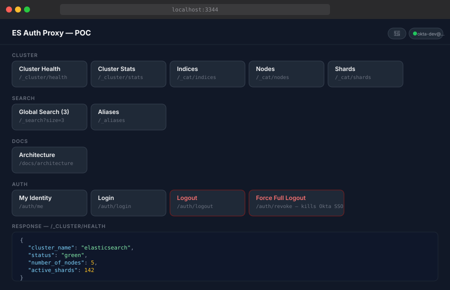

<p align="center">
  
</p>

# es-okta-auth-proxy

An authentication proxy that gates Elasticsearch access behind Okta SSO — translating OIDC identity into ES API key credentials without requiring a paid Elastic license.

Elasticsearch's native SSO (SAML, OIDC, LDAP) requires Gold or Platinum. This proxy fills that gap for clusters running on the free Basic license (including ECK operator deployments).

## Dashboard

<p align="center">
  
</p>

## How it works

```
Browser → es-okta-auth-proxy (Okta OIDC) → Elasticsearch (API key injected)
                    ↑
                  Okta
```

Every request is gated by an Okta login. After authentication, the proxy strips any incoming `Authorization` header and replaces it with a pre-issued ES API key before forwarding to Elasticsearch. The ES cluster only ever sees API key auth — it has no knowledge of the user's identity.

Optional group-based mapping assigns different API keys (with different role_descriptors) to different Okta groups, giving you coarse-grained RBAC without a license upgrade.

## Requirements

- Node 18+
- An Okta application (OIDC, web app type) — free [Okta Integrator](https://developer.okta.com/) plan works
- An Elasticsearch cluster on Basic license
- Docker or Podman

## Quick start

```bash
git clone https://github.com/slmingol/es-okta-auth-proxy
cd es-okta-auth-proxy
cp .env.example .env
# fill in .env with your Okta and ES credentials
make build
make up
open http://localhost:3344
```

## Docker / Podman

The proxy ships as a multi-stage container image (node:22-alpine). The Makefile auto-detects Docker or Podman and the appropriate compose variant.

**Build and run with Docker Compose:**

```bash
docker compose up -d
```

**Build and run with Podman Compose:**

```bash
podman compose up -d
```

**Run directly (without Compose):**

```bash
docker build -t es-okta-auth-proxy .
docker run -d \
  --env-file .env \
  -v $(pwd)/config:/app/config \
  -p 3344:3344 \
  es-okta-auth-proxy
```

The `config/` directory is mounted as a volume so `group-map.json` can be updated (and rewritten by key rotation) without rebuilding the image. In Kubernetes, mount it as a Secret volume at `/app/config/group-map.json`.

## Okta setup

1. Create an OIDC web application in Okta (Applications > Create App Integration > OIDC)
2. Set Sign-in redirect URI to `http://localhost:3344/auth/callback`
3. Set Sign-out redirect URI to `http://localhost:3344`
4. Note the Client ID and Client Secret — add to `.env`
5. Under **Security > API > Authorization Servers > default > Access Policies**, ensure a policy exists that allows your app
6. Under **Security > API > Authorization Servers > default > Claims**, add a claim:
   - Name: `groups`, Include in: ID Token, Value type: Groups, Filter: Matches regex `.*`

## ES API key

Issue a key against your cluster with the permissions your use case needs:

```json
POST /_security/api_key
{
  "name": "es-okta-proxy-default",
  "role_descriptors": {
    "proxy-access": {
      "cluster": ["monitor"],
      "indices": [{ "names": ["*"], "privileges": ["read", "view_index_metadata"] }]
    }
  }
}
```

Encode the response as `base64(id:api_key)` and set as `ES_API_KEY`.

## Group-based RBAC (optional)

Copy the example and populate with real keys and role descriptors:

```bash
cp config/group-map.example.json config/group-map.json
```

```json
{
  "_priority": ["es-admin", "es-readonly"],
  "_roles": {
    "es-admin":   { "cluster": ["all"], "indices": [{ "names": ["*"], "privileges": ["all"] }] },
    "es-readonly": { "cluster": ["monitor"], "indices": [{ "names": ["*"], "privileges": ["read"] }] }
  },
  "es-admin":   "BASE64_KEY",
  "es-readonly": "BASE64_KEY",
  "_default":   "BASE64_FALLBACK_KEY"
}
```

Create matching groups in Okta (Directory > Groups), assign users, and the proxy routes each user to the right key based on their first matching group in `_priority`.

## Built-in key rotation

The proxy can rotate its own ES API keys on a schedule. Add to `.env`:

```
ES_ROTATION_CREDS=elastic:your-password
KEY_ROTATION_HOURS=24
```

The rotation key needs `manage_api_key` cluster privilege. Basic auth (`ES_ROTATION_CREDS`) is recommended over `ES_ROTATION_KEY` (API key) to avoid ES derived-key privilege restrictions.

To trigger a manual rotation:

```bash
podman exec -i es-okta-auth-proxy-proxy-1 node --input-type=module << 'EOF'
import { loadGroupMap } from '/app/src/group-map.js';
import { rotateKeys } from '/app/src/rotate.js';
loadGroupMap();
await rotateKeys();
EOF
```

## Routes

| Route | Auth | Purpose |
|---|---|---|
| `GET /` | No | Dashboard UI |
| `GET /status` | No | JSON health check |
| `GET /auth/login` | — | Initiates Okta OIDC flow |
| `GET /auth/callback` | — | Okta redirect target |
| `GET /auth/me` | Yes | Current session user + groups |
| `GET /auth/logout` | — | Destroys local session |
| `GET /auth/revoke` | — | Revokes token + kills Okta SSO globally |
| `GET /docs/architecture` | No | Architecture reference doc |
| `/_*` | Yes | All ES API paths — proxied with API key |

## Access logging

Every proxied ES request is logged to stdout as JSON:

```json
{"ts":"2026-09-15T12:00:00.000Z","user":"user@example.com","groups":["es-admin"],"method":"GET","path":"/_cluster/health","status":200,"ms":87}
```

## Make targets

```
make build     build the container image
make up        start the proxy
make down      stop and remove containers
make restart   rebuild and restart
make logs      tail container logs
make shell     exec into the running container
make status    show running containers
make env-init  copy .env.example to .env
```

## Mock mode

Run without a real ES cluster for testing the auth flow:

```
ES_URL=mock
```

## Production notes

- Session storage is in-memory — use Redis-backed sessions for multi-instance deployments
- Set `cookie.secure: true` and run behind HTTPS
- Mount `config/group-map.json` as a Kubernetes Secret volume in K8s deployments
- `GROUP_MAP_PATH` env var overrides the default config path

## Bandwidth Internal Deployment (sandbox)

Live on `paas-test-cluster` via ArgoCD/Helm.

| App | Link |
|---|---|
| App-of-Apps | https://argocd.sbx1.eks.platform.bandwidth.com/applications/platform/es-okta-auth-proxy-apps |
| swi-app-chart (workload) | https://argocd.sbx1.eks.platform.bandwidth.com/applications/platform/es-okta-auth-proxy-swi-app-chart-sandbox |
| Image Updater | https://argocd.sbx1.eks.platform.bandwidth.com/applications/platform/es-okta-auth-proxy-image-updater |

Ingress: `https://es-okta-auth-proxy.paas-test-cluster.paas.lab.us.aws.bandwidth.com`

## License

MIT
