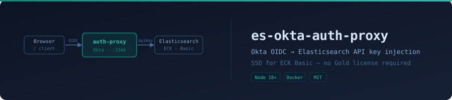
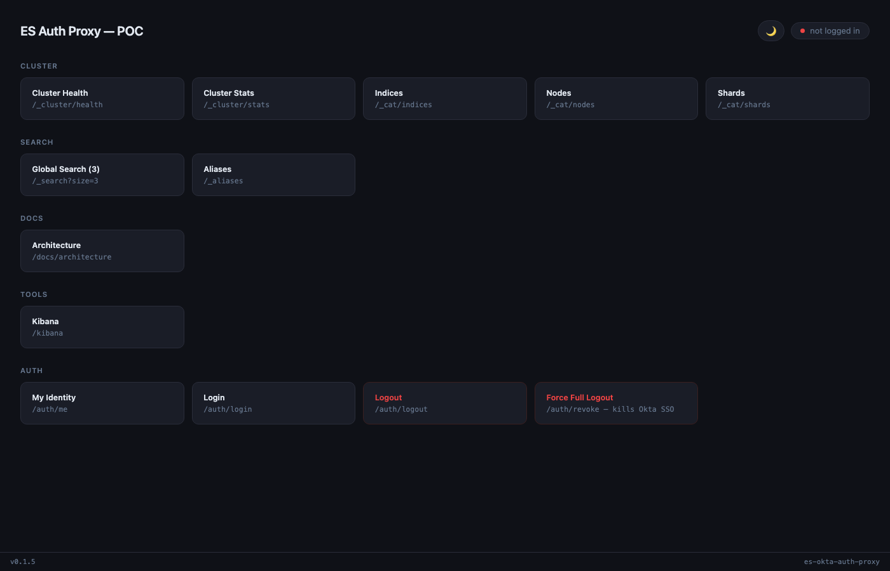

<p align="center">
  
</p>

# es-okta-auth-proxy

An authentication proxy that gates Elasticsearch access behind Okta SSO — translating OIDC identity into ES API key credentials without requiring a paid Elastic license.

Elasticsearch's native SSO (SAML, OIDC, LDAP) requires Gold or Platinum. This proxy fills that gap for clusters running on the free Basic license (including ECK operator deployments).

## Dashboard

<p align="center">
  
</p>

## How it works

```
                                                    ┌─→ Elasticsearch (API key injected)
Browser → es-okta-auth-proxy (Okta OIDC) ──────────┤
                    ↑                               └─→ Kibana → Elasticsearch
                  Okta
```

Every request is gated by an Okta login. After authentication, the proxy strips any incoming `Authorization` header and replaces it with a pre-issued ES API key before forwarding to Elasticsearch. The ES cluster only ever sees API key auth — it has no knowledge of the user's identity.

For Kibana, the proxy reverse-proxies `/kibana/*` traffic and injects an identity banner into every Kibana HTML page via a `<script src="/kibana-user.js">` tag.

Optional group-based mapping assigns different API keys (with different `role_descriptors`) to different Okta groups, giving you coarse-grained RBAC without a license upgrade.

Non-browser tools (Kibana, Grafana) authenticate with static bearer tokens that the proxy maps to ES API keys — no OIDC required.

> **What's unauthenticated:** `/`, `/status`, `/live`, `/ready`, and `/docs/architecture` are public. Everything else requires an Okta session or a valid service bearer token.

## Requirements

- Node 18+ (image uses node:24-alpine)
- An Okta application (OIDC, web app type) — free [Okta Integrator](https://developer.okta.com/) plan works
- An Elasticsearch cluster on Basic license
- Docker or Podman

## Quick start

```bash
git clone https://github.com/slmingol/es-okta-auth-proxy
cd es-okta-auth-proxy
cp env.example .env      # note: env.example, not .env.example
# fill in .env with your Okta and ES credentials
make build
make up
open http://localhost:3344
```

> **Env templates:** two files exist — `env.example` (canonical, used by `make env-init`) and `.env.example` (legacy). Use `env.example` as your reference.

## Docker / Podman

The proxy ships as a multi-stage container image (node:24-alpine). The Makefile auto-detects Docker or Podman and the appropriate compose variant.

```bash
make up        # starts proxy (and Kibana if configured in docker-compose.yml)
make down      # stop
make restart   # down then up (no rebuild — use make build first if code changed)
```

The `config/` directory is mounted as a volume so `group-map.json` can be updated without rebuilding the image.

## Okta setup

**Constraint:** the proxy uses the `/oauth2/default` custom authorization server — the Okta org authorization server is not supported. `OKTA_DOMAIN` must be a bare hostname with no scheme or trailing slash (e.g. `your-org.okta.com`).

1. Create an OIDC web application in Okta (Applications > Create App Integration > OIDC)
2. Set Sign-in redirect URI to `http://localhost:3344/auth/callback`
3. Set Sign-out redirect URI to `http://localhost:3344`
4. Note the Client ID and Client Secret — add to `.env`
5. Under **Security > API > Authorization Servers > default > Access Policies**, ensure a policy exists that allows your app
6. Under **Security > API > Authorization Servers > default > Claims**, add a claim:
   - Name: `groups`, Include in: ID Token, Value type: Groups, Filter: Matches regex `.*`

> **Groups claim is required.** If a user has no groups in the ID token, they silently fall back to `_default` / `ES_API_KEY`. No error is shown.

## ES API key

Issue a key against your cluster with the permissions your use case needs:

```json
POST /_security/api_key
{
  "name": "es-okta-proxy-default",
  "role_descriptors": {
    "proxy-access": {
      "cluster": ["monitor"],
      "indices": [{ "names": ["*"], "privileges": ["read", "view_index_metadata"] }]
    }
  }
}
```

Encode the response as `base64(id:api_key)` and set as `ES_API_KEY`.

## Group-based RBAC (optional)

Copy the example and populate with real keys and role descriptors:

```bash
cp config/group-map.example.json config/group-map.json
```

```json
{
  "_priority": ["es-admin", "es-readonly"],
  "_roles": {
    "es-admin":    { "cluster": ["all"], "indices": [{ "names": ["*"], "privileges": ["all"] }] },
    "es-readonly": { "cluster": ["monitor"], "indices": [{ "names": ["*"], "privileges": ["read"] }] }
  },
  "es-admin":   "BASE64_KEY",
  "es-readonly": "BASE64_KEY",
  "_default":   "BASE64_FALLBACK_KEY"
}
```

Create matching groups in Okta (Directory > Groups), assign users. The proxy routes each user to the right key based on their first matching group in `_priority`.

> **`_priority` is required for rotation.** If omitted, group keys are never rotated (silent). The `_roles` block defines the permissions used when re-issuing keys during rotation.

## Service account access (Kibana, Grafana, etc.)

Non-browser tools that can't do an OIDC flow authenticate with a static `Bearer` token. The proxy maps each token to an ES API key via `_services` in `group-map.json`:

```json
{
  "_services": {
    "kibana-secret-token-abc123":  "BASE64_ES_KEY_FOR_KIBANA",
    "grafana-secret-token-xyz789": "BASE64_ES_KEY_FOR_GRAFANA"
  },
  "_service_roles": {
    "kibana-secret-token-abc123":  { "cluster": ["monitor"], "indices": [{ "names": ["*"], "privileges": ["read"] }] },
    "grafana-secret-token-xyz789": { "cluster": ["monitor"], "indices": [{ "names": ["metrics-*"], "privileges": ["read"] }] }
  }
}
```

Configure the tool to send `Authorization: Bearer <token>` on every request. The proxy intercepts it before any OIDC check, swaps in the mapped ES API key, and forwards to Elasticsearch. Each service gets its own token and its own scoped ES API key.

The bearer token (the service's credential to the proxy) never changes. When `_service_roles` is defined, the built-in rotation mechanism automatically rotates the backing ES API keys on the same schedule as group keys (`KEY_ROTATION_HOURS`).

> **Security:** bearer tokens are compared in plaintext — use a long random value (`openssl rand -hex 32`). A leaked token gives unauthenticated access to the mapped key's ES privileges on any path. Revoke by removing the entry from `_services`.

## Kibana setup

Kibana requires specific configuration to run behind the proxy. Set `KIBANA_URL` in `.env` to enable Kibana proxying (the feature is silently disabled without it).

**`kibana.yml` required settings:**

```yaml
server.basePath: /kibana
server.rewriteBasePath: true
elasticsearch.hosts: ["http://es-okta-auth-proxy:3344"]
elasticsearch.customHeaders:
  Authorization: "Bearer <your-service-bearer-token>"
xpack.security.enabled: false
elasticsearch.sniffOnStart: false
elasticsearch.sniffInterval: false
elasticsearch.sniffOnConnectionFault: false
```

**Bootstrap order** (first time only):

1. Create an ES API key for Kibana (see [ES API key](#es-api-key) section)
2. Generate a bearer token: `openssl rand -hex 32`
3. Add both to `group-map.json` under `_services` (and `_service_roles` if using rotation)
4. Set the same bearer token as `elasticsearch.customHeaders.Authorization` in `kibana.yml`
5. Start the proxy, then start Kibana

> **The bearer token in `kibana.yml` must exactly match the key in `_services`.** Kibana will fail to connect if they differ.

## Built-in key rotation

The proxy can rotate its own ES API keys on a schedule. Add to `.env`:

```
ES_ROTATION_CREDS=elastic:your-password
KEY_ROTATION_HOURS=24
```

The rotation key needs `manage_api_key` cluster privilege. Basic auth (`ES_ROTATION_CREDS`) is recommended over `ES_ROTATION_KEY` (API key) — ES does not allow derived keys to use `manage_api_key`.

**Rotation caveats:**
- Rotation only fires on `setInterval` — there is no rotation at startup. With frequent redeploys and a long interval, keys may not rotate as expected.
- Rotation uses HTTPS. It will fail silently against `http://` ES URLs.
- Rotated keys are written back to `group-map.json` on disk. **Do not mount `group-map.json` as a read-only ConfigMap if rotation is enabled** — the write is silently swallowed, the old key is still invalidated in ES, and the next pod restart loads the now-dead key, causing 401s for all users. Use a writable volume or disable rotation in Kubernetes.

To trigger a manual rotation:

```bash
podman exec -i es-okta-auth-proxy-proxy-1 node --input-type=module << 'EOF'
import { loadGroupMap } from '/app/src/group-map.js';
import { rotateKeys } from '/app/src/rotate.js';
loadGroupMap();
await rotateKeys();
EOF
```

## TLS / self-signed certificates (ECK)

By default the proxy verifies TLS certificates when connecting to Elasticsearch. For ECK clusters using self-signed certs, set:

```
ES_TLS_VERIFY=false
```

This disables verification for both the proxy and rotation calls. For production, mount the ECK CA bundle and set `NODE_EXTRA_CA_CERTS=/path/to/ca.crt` instead.

## Routes

| Route | Auth | Purpose |
|---|---|---|
| `GET /` | No | Dashboard UI |
| `GET /live` | No | Liveness probe — always 200 |
| `GET /ready` | No | Readiness probe — 503 until Okta discovery completes |
| `GET /status` | No | JSON: version, ES URL, current session user |
| `GET /auth/login` | — | Initiates Okta OIDC flow |
| `GET /auth/callback` | — | Okta redirect target |
| `GET /auth/me` | Yes | Current session user + groups |
| `GET /auth/logout` | — | Destroys local session |
| `GET /auth/revoke` | — | Revokes Okta token + kills SSO globally |
| `GET /docs/architecture` | No | Architecture reference doc |
| `GET /kibana-user.js` | Yes | Identity banner script injected into Kibana HTML |
| `ANY /kibana/*` | Yes | Kibana reverse proxy (requires `KIBANA_URL`) |
| `/_*` | Yes | ES API paths prefixed with `_` |
| `/:index/_*` | Yes | Index-named ES paths (`/myindex/_search`, `/myindex/_doc/1`, etc.) |

> **k8s probes:** use `/live` for liveness and `/ready` for readiness. `/ready` returns 503 while Okta OIDC discovery is in progress at startup.

## Access logging

Every successfully proxied ES request is logged to stdout as JSON. Kibana traffic, 401s, and 404s are not logged.

```json
{"ts":"2026-09-15T12:00:00.000Z","user":"user@example.com","groups":["es-admin"],"method":"GET","path":"/_cluster/health","status":200,"ms":87}
```

## Make targets

```
make build          build the container image
make up             start the proxy (and Kibana if in docker-compose.yml)
make down           stop and remove containers
make restart        stop and start (no rebuild)
make logs           tail container logs
make shell          exec into the running container
make status         show running containers
make env-init       copy env.example to .env
make env-check      validate required env vars are set
make clean          remove containers, images, and volumes
make check-version  verify image.tag matches in argocd sandbox values
```

## Mock mode

Run without a real ES cluster for testing the auth flow. **Okta is still required** — mock mode only replaces the ES backend.

```
ES_URL=mock
```

Mock endpoints: `/_cluster/health`, `/_cat/indices`, `/_search`, `/:index/_search`, and a catch-all returning `{"acknowledged":true,"mock":true}`.

## Environment variables

| Variable | Required | Default | Description |
|---|---|---|---|
| `OKTA_DOMAIN` | Yes | — | Bare hostname, e.g. `your-org.okta.com` |
| `OKTA_CLIENT_ID` | Yes | — | OIDC app client ID |
| `OKTA_CLIENT_SECRET` | Yes | — | OIDC app client secret |
| `OKTA_REDIRECT_URI` | Yes | — | Must match Okta Sign-in redirect URI |
| `OKTA_POST_LOGOUT_URI` | No | — | Redirect after Okta SSO logout |
| `ES_URL` | Yes | — | Elasticsearch URL or `mock` |
| `ES_API_KEY` | Yes | — | Fallback base64 ES API key |
| `ES_TLS_VERIFY` | No | `true` | Set `false` for self-signed certs |
| `SESSION_SECRET` | Yes | — | Session signing secret |
| `PORT` | No | `3344` | Port the proxy listens on |
| `COOKIE_SECURE` | No | `false` | Set `true` behind HTTPS |
| `KIBANA_URL` | No | — | Enables Kibana proxy (e.g. `http://kibana:5601`) |
| `GROUP_MAP_PATH` | No | `./config/group-map.json` | Path to group map file |
| `ES_ROTATION_CREDS` | No | — | `user:password` for key rotation |
| `ES_ROTATION_KEY` | No | — | API key for rotation (use `ES_ROTATION_CREDS` instead) |
| `KEY_ROTATION_HOURS` | No | `0` (off) | Rotate keys every N hours |

## Versioning

The version displayed in the dashboard footer is sourced at runtime from `/tplConfig/version` when running in Kubernetes (write this file via a ConfigMap or Helm template). Fallback order (local dev): `APP_VERSION` env var → `package.json` version field (`0.0.0-dev`).

## Production notes

- **Session storage is in-memory** — all sessions are lost on pod restart. Use Redis-backed sessions for multi-instance deployments.
- **Set `COOKIE_SECURE=true`** when running behind HTTPS.
- **`group-map.json` in Kubernetes:** mount as a writable `emptyDir` volume seeded from a ConfigMap or Vault secret. If you mount it read-only and enable rotation, rotated keys cannot be written back, causing 401s after the next restart.
- **`GROUP_MAP_PATH`** must be set when the file is not at the default path (`./config/group-map.json`).

## Troubleshooting

| Symptom | Likely cause |
|---|---|
| Redirect to Okta login loops or fails | `OKTA_REDIRECT_URI` doesn't match Okta app exactly |
| `401 Authentication failed` at `/auth/callback` | `state`/`nonce` mismatch — usually a clock skew or stale cookie |
| User lands on `_default` key instead of their group's key | `groups` claim missing from ID token — check Okta claims config |
| `/ready` returns 503 at startup | Okta OIDC discovery still in progress — this is normal for a few seconds |
| `502 ES proxy error: unable to verify the first certificate` | Self-signed cert — set `ES_TLS_VERIFY=false` or mount CA via `NODE_EXTRA_CA_CERTS` |
| `ApiKey undefined` proxied to ES | `ES_API_KEY` not set and no `_default` in group map |
| All users get 401 after pod restart | Rotation wrote new keys but `group-map.json` is read-only — see [Built-in key rotation](#built-in-key-rotation) |
| Kibana fails to connect to ES | Bearer token in `kibana.yml` doesn't match `_services` entry, or `KIBANA_URL` not set |

## License

MIT
